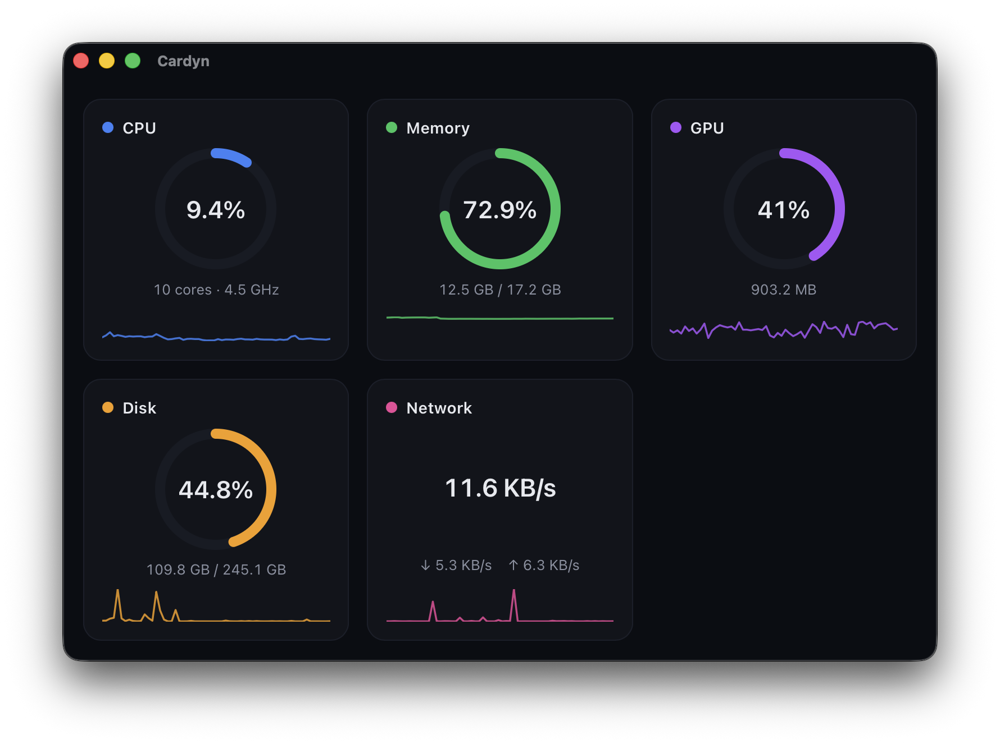

<p align="center">
  
</p>

# Cardyn

A minimalist macOS system monitor you can read at a glance.

Cardyn shows the essential health of your Mac - CPU, memory, GPU, disk, and network - in a clean, dark window, plus a live readout in the menu bar. It is a calm, opinionated take on the system monitor: the same vital signs as Activity Monitor, presented to be understood in a second instead of read from a table.



## Features

- **Five live metrics** at 1 Hz: CPU (total, per-core, frequency), Memory (used / available + swap), GPU (utilization and memory), Disk (space + read/write throughput), and Network (down / up).
- **Menu-bar readout** - a tray icon with a live `CPU x% RAM y%` title. Closing the window keeps Cardyn running in the menu bar.
- **Per-metric detail** - click any card for a ~60s history chart with a click-to-inspect pin, a breakdown (per-core CPU, memory segments, VRAM, ...), and the top 5 processes by CPU or memory.
- **Quiet by design** - a dark, focused interface with per-metric accent colors; the view updates once a second, no flashing, no clutter.

## Status

v1, in development. macOS only (Apple Silicon and Intel; the dedicated-GPU readout on Intel Macs is not yet validated). Read-only - Cardyn never kills or modifies processes.

## Build from source

Requirements: macOS, [Rust](https://rustup.rs) (stable), Node.js 24+, [pnpm](https://pnpm.io), and the Xcode Command Line Tools.

```sh
pnpm install
pnpm tauri dev      # run in development
pnpm tauri build    # produce a release .app + .dmg
```

Prebuilt, signed releases and a Homebrew cask will come with the first tagged release.

## Tech

Built with [Tauri 2](https://tauri.app) (Rust) and [Svelte 5](https://svelte.dev). System metrics via [sysinfo](https://crates.io/crates/sysinfo); the GPU readout uses macOS IOKit.

## License

MIT - see [LICENSE](LICENSE).
